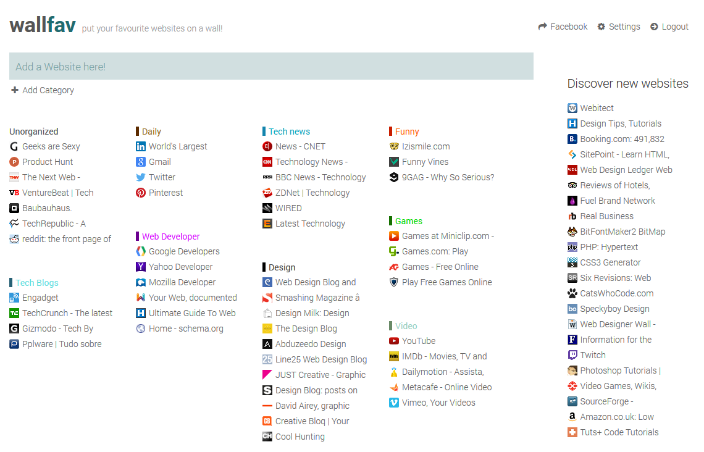

# wallfav
*Open source version of wallfav project*

So, some years ago (2014) I started a project of mine where it was possible for a user to put their favourite websites "in a wall". It was a pratical way to manage bookmarks.

wallfav.com was the domain, but because the project didn't have a lot of success, I took it down, although I use it everyday hosted in my localhost.

Wallfav looks something like this:

I decided to share the code to make a small contribution to the opensource community. (the code/db were stripped a little bit)

Now that I revisited the code, I see several mistakes or things that could be made in a different way, so I DO NOT recommend you use this in production. Use it at your own responsability.

Like with this project I was able to learn about MVC, improve OOP notions, start with a task runner, etc, I hope it can help you in some way to improve your knowledge.

Things you need to do:
- setup up `node`, `grunt` and `composer`;
- point the server to `public` folder;
- change configs in `config/config.php`;
- import db located in `data/db_wallfav_opensource.zip`;
- login is made automatically (change this if you want several users);
